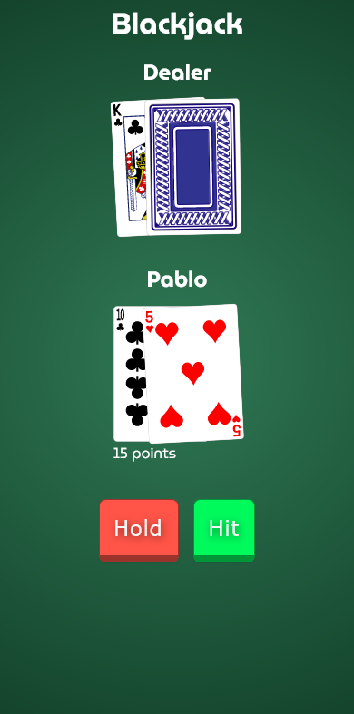
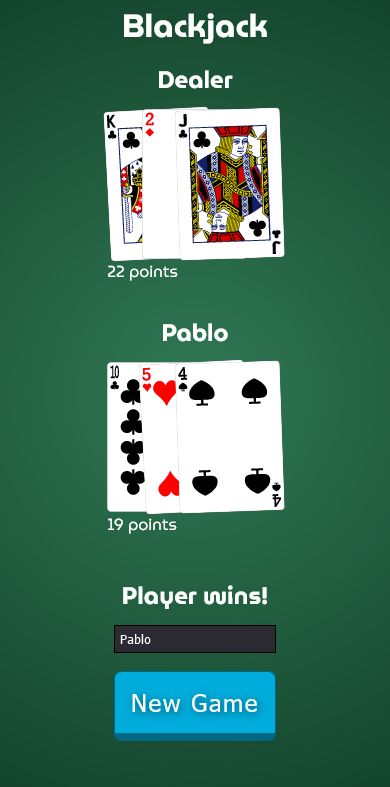
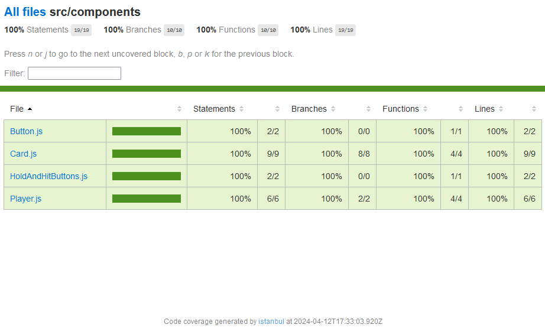

This file includes information on how to run the app and observations about further improvements.

## Screenshots




## Getting Started

First, set up the backend url env var. In the `.env` file, set `NEXT_PUBLIC_BACKEND_URL` to your backend URL. There is an example in the `.env.example` file.

Then you can run the app:

```bash
npm run dev
```

Open [http://localhost:3000](http://localhost:3000) with your browser to see the result.

## Testing

I'm using Cypress for the testing. I've added only component testing, since I didn't have any more time to add e2e (which is configured).

I've run into some issues setting up coverage with Next.js, since Istanbul is not currently working with SWC.

I was able to run a coverage report with a `babel` config, but had to remove that in order for the app to work correctly.

Here's a screenshot of the coverage:



In order to run the tests (without coverage support) you can use the following command:

```bash
npm run cypress:open
```

## Further improvements

Here are some further improvements that I couldn't add for lack of time:

- Currently the app renders everything from the server response. A better solution for this would be to use some king of store management, like `redux-saga` and update the UI components dispatching actions with incremental changes.
- Related to the previous point, in a real-world game, the frontend would also implement some of the business logic (like dealing cards and points calculation), and reconcile with the backend, to allow faster interactions between the user and the app.
- The UI could be improved with animations, using something like Framer Motion ([something like this](https://codesandbox.io/p/sandbox/framer-motion-layout-animations-forked-ywcz5q?file=%2Fsrc%2FApp.tsx)).
- Add e2e testing.
